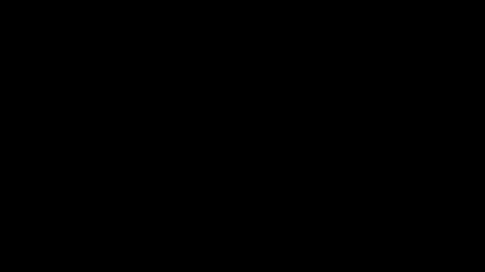

+++
author = "Jose Lopes"
title = "Notes on Backpropagation"
date = "2024-05-04"
description = "Notes on backpropagation"
series = ["Themes Guide"]
aliases = ["migrate-from-jekyl"]
+++

Some notes on backpropagation.
<!--more-->

## Help links

Fast AI's [Lesson 13](https://course.fast.ai/Lessons/lesson13.html) by Jeremy
Howard goes into great detail to explain backpropagation.
To understand more about the mathematics behind backpropagation and how it works in pytorch, I recommend
[this](https://nasheqlbrm.github.io/blog/posts/2021-11-13-backward-pass.html#notation)
blog post (also recommended by Jeremy).

## Introduction

This blog post focus on backpropagation and on the optimization of a Single-Layer Perceptron (SLP).
The idea is to provide a minimum working example that can be used to understand the underlying concepts. Frameworks, such as Pytorch, provide a lot of functionality that abstracts way the details of training a neural network. Hopefully, this post will help to close the gap between theory and practice.

The full code used in this post can be found [here](#code).

## Single-Layer Perceptron

An SLP is a simple neural network that has one layer of neurons and directly connects the input to the ouput.
It can be defined as a function \(o=f(i,z)\) with parameters that map multivariate inputs \(i\) to multivariate outputs \(o\).

Note: The activation function has been omitted from this example for simplicity.

The example at hand assumes that the input \(i\) is a vector of \(d\) dimensions, and the output \(o\) is a vector of \(d\) dimensions.

The functions to calculate the output of each neuron are shown below. The \(θ_n\) corresponds to a one-dimensional vector of weights with size \(d\),
associated with a neuron \(n\), that is used to map the input to the output of the neuron.

\[o_0 = b_0 + θ_0 \cdot x^d\]
\[o_1 = b_1 + θ_1 \cdot x^d\]
\[o_2 = b_2 + θ_2 \cdot x^d\]
\[o_3 = b_3 + θ_3 \cdot x^d\]

## Loss Function

To be done

## Backpropagation

To be done

## Code
    #!/usr/bin/env python3
    
    import numpy as np
    
    # Make sure the results are reproducible
    np.random.seed(0)
    
    # Print helper function
    def print_with_name(*args):
        for arg in args:
            print(f"""{arg[0]}: {arg[1]}""")
    
    # Calculate the loss function (mean of the squared differences)
    def loss_function_mse(inputs, results):
        # Calculate the mean of the squared differences
        squared_diff = np.square(inputs - results).sum(1)
        return squared_diff.mean()
    
    # Number of dimensions of the input
    D = 4
    # Number of inputs
    N = 1
    
    weights_test = np.random.normal(size=(4,4))
    bias_test = np.random.normal(size=(4,))
    
    inputs = np.random.normal(size=(1,D))
    
    print("### Results before training ###")
    pre_output = inputs @ weights_test + bias_test
    print_with_name(
        ("Inputs", inputs),
        ("Outputs", pre_output),
        ("Loss", loss_function_mse(inputs, pre_output))
    )
    
    # train loop
    for epoch in range(1000):
        # Forward pass
        result = inputs @ weights_test + bias_test
        # Backward pass
        dL_dO = 2/N * (inputs - result)
        ## Single layer Jacobian
        dL_dW = inputs.T @ dL_dO
        dL_db = dL_dO.sum(0)
        # Update
        weights_test += 0.001 * dL_dW
        bias_test += 0.001 * dL_db
    
        outputs = inputs @ weights_test + bias_test
        print(f"Iteration {epoch} - MSE: {loss_function_mse(inputs, outputs)}")
    
    outputs = inputs @ weights_test + bias_test
    
    print("### Results after training ###")
    print_with_name(
        ("Inputs", inputs),
        ("Outputs", outputs),
        ("Loss", loss_function_mse(inputs, outputs))
    )