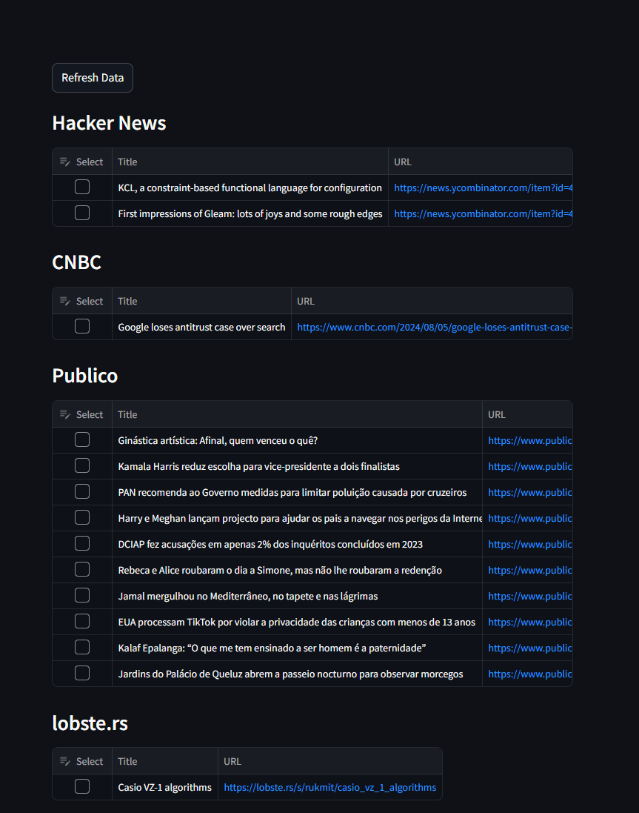
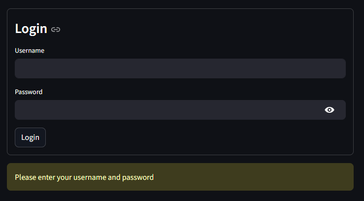

+++
author = "Jose Lopes"
title = "Personal newsletter"
date = "2024-08-05"
description = "Notes on backpropagation"
series = ["Themes Guide"]
aliases = ["migrate-from-jekyl"]
+++

<!--more-->

## Introduction

This [blog post](https://muxup.com/pwr) by Alex Bradbury opened my eyes
to the ammount of time I spend each day reading the news. There is nothing wrong with it, but the law of diminishing returns applies.
The more time I spend reading the news, the more likely I am to read the same news over and over again. The pwr tool is great, but it doesn't completly
solve my problems:

 - More often than not I need to read the news in multiple devices. For example, I would like to use the same tool to read the news at work and at home.
 - I would like for the news to only update when I want them too, and not when the news source updates. This is because I might, that way, I'm less likely to lose any news.

## The idea

My idea was to convert pwr into a web version using streamlit. [Steamlit](https://streamlit.io/) is useful to create quick and minimalistic web apps
in python that can be used to present data in a web browser. Using the browser, it should solve my problem with multiple devices.

## The result

The webpage currently only has one single feature, the "Refresh Data" buttom. 

When pressed, this button will refresh the data from the news sources
and cache them until the buttom is pressed again. Refreshing the data while refreshing the webpage would not work because I would only be able to see the data once.

The website is also password protected to ensure minimal data protection.

## The code

The code can be found in my fork of the pwr tool [here](https://github.com/patosgui/pwr). This code was quickly hacked together and it is by no means production ready.
